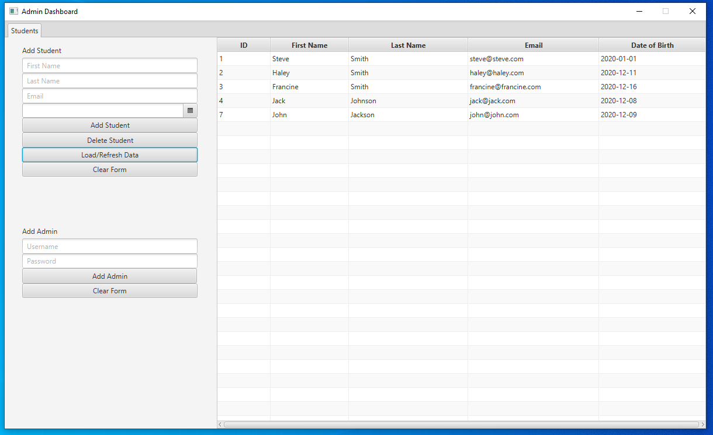

 <h1 align="center">School Management System</h1>

 <br>

## About The Project



This is an application that functions as a student database. It was created using Java, JavaFX, the SceneBuilder editor tool, and MySQL.

For the backend, it uses a schema called "school", along with a "students" table and a "login" table using MySQL Server and Workbench.
The students table is a table that holds entries that contain the columns ID, first_name, last_name, email, and DOB. The ID is the primary key and autoincrements. These columns are referencing "Student Data" entries.
The login table is a table that holds entries containing the columns username and password. These columns are referencing username and password login information to enter the system.

For the frond end, it is using the SchoolManagementSystem Java project. In it's src folder, it contains an admin package, a dbutil package and a login package. The admin and login package use a model-view-controller pattern to develop each window of the application.
* The dbutil package contains the java class file DatabaseConnection.java, which is used to establish a connection to the MySQL database on the schema "school" by using the appropriate credentials and URL of the database.
* The login package contains LoginModel.java, LoginController.java, LoginModel.java, and Login.fxml. They are the model, controller, view and fxml files respectively for the initial windows that appears when the program is launched.
* The admin package contains AdminModel.java, AdminController.java, and Admin.fxml. They are the model, controller, and fxml files respectively for the windows that launches upon successful login into the application via the first window.

## Getting Started

### Prerequisites
The following needed to be installed via commands in the terminal:
* In the main project folder:
```sh 
npx create-react-app folder_name
```

```sh
npm init -y
```

```sh
npm install express cors mongoose dotenv
```

* In the backend folder:

```sh
npm install -g nodemon
```

* In the src folder:
```sh
npm install bootstrap
```

```sh
npm install react-router-dom
```


## Usage
The basic functionality of the website is as follows:

* Run the server file by going to the backend directory and using the following command
```sh
nodemon server
```

* In the main project directory use the following command
```sh
npm start
```

<hr>

* The main page displays all of the logged exercises. From here, a user can either edit or delete an exercise log. Clicking the edit button brings the user to a page where they can edit the exercise log. Clicking delete will delete the exercise log from the list.


<hr>

* Clicking the Create Exercise Log tab of the navbar on the top of a page will bring the user to the page where they can create a new exercise log.


<hr>

* In the edit exercise page, the user can edit any of the aspects of any exercise log. Clicking the Edit Exercise Log button will update the respective exercise log in the Logged Exercises list on the main page of the website.


<hr>

* Clicking the Exercises tab of the navbar on the top of a page will bring the user to the main page of the website.


<hr>

* Clicking the Create User tab of the navbar on the top of a page will bring the user to the page where they can create a new user to be entered in the Username section of an exercise log.


## Resources Used

This project was based off of this YouTube tutorial: https://www.youtube.com/watch?v=7CqJlxBYj-M