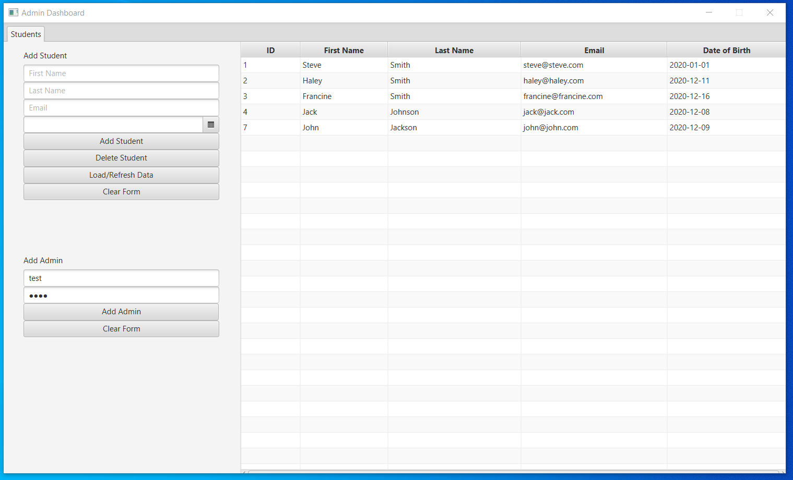

 <h1 align="center">School Management System</h1>

 <br>

## About The Project


This is a desktop application that functions as a student database. It was created using Java, JavaFX, the SceneBuilder editor tool, and MySQL.

For the backend, it uses a schema called "school", along with a "students" table and a "login" table using MySQL Server and Workbench.
* The students table is a table that holds entries that contain the columns <i>ID</i>, <i>first_name</i>, <i>last_name</i>, <i>email</i>, and <i>DOB</i>. The ID column is the primary key and it automatically increments. These columns are referencing "Student Data" entries.
* The login table is a table that holds entries containing the columns <i>username</i> and <i>password</i>. These columns are referencing username and password login information to enter the system.

For the frond end, it is using the SchoolManagementSystem Java project folder. In it's src folder, it contains an admin package, a dbutil package and a login package. The admin and login package use a model-view-controller pattern to develop each window of the application.
* The dbutil package contains the java class file DatabaseConnection.java, which is used to establish a connection to the MySQL database on the schema "school" by using the appropriate credentials and URL of the database.
* The login package contains LoginModel.java, LoginController.java, Login.java, and Login.fxml. They are the model, controller, view and fxml files respectively for the initial window that appears when the program is launched.
* The admin package contains StudentData.java, AdminModel.java, AdminController.java, and Admin.fxml. The StudentData.java file defines the structure of each student in the database, and the rest of the fles are the model, controller, and fxml files respectively for the window that launches upon successful login into the application via the first window.
<br>

## Getting Started

### Prerequisites
The JavaFX SDK needed to be imported as a library in the build path.

The following run configurations needed to be set as VM arguments:
```sh
--module-path "C:\Program Files (x86)\Java\jre1.8.0_91\lib\javafx-sdk-15.0.1\lib" 
--add-modules javafx.controls,javafx.fxml
```

A MySQL JDBC driver had to be imported to provide the program with a connection to the MySQL database.
<br>
<br>

## Usage
The basic functionality of the website is as follows:

* The program is launched and the School Management System windows appears.


<hr>

* The user must enter the right credentials as per the login table of the school schema and click the login button.


<hr>

* This brings up the Admin Dashboard of the application.


<hr>

* From here the user can click the Load/Refresh Data button to bring up all of the information in the students table of the school schema.


<hr>

* The user can add a student by entering information into the text boxes in the Add Student section of the page, then clicking the Add Student button. Load/Refresh Student will need to be clicked to refresh the table.


<hr>

* The user can delete a student by clicking on the row of the student they want to delete, then clicking the Deleted Student button. Load/Refresh Student will need to be clicked to refresh the table.


<hr>

* The user can clear the text boxes in the Add Student section by clicking the Clear Form button in the Add Student section.


<hr>

* The user can add an Admin by entering information into the text boxes in the Add Admin section of the page, then clicking the Add Admin button.



<hr>

* The user can clear the text boxes in the Add Admin section by clicking the Clear Form button in the Add Admin section.


<br>

## Resources Used

This project was based off of the following YouTube tutorial: https://www.youtube.com/watch?v=h1rYlMrvNyE
* MySQL was used instead of SQLite.
* The button for deleting entries was not done in the video.
* The Add Admin button was not done in the video.
